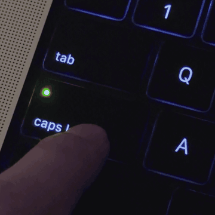
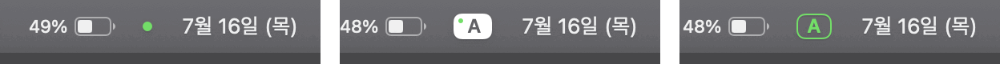
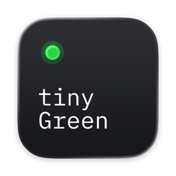

<p align="center">
  
</p>

<p align="center">
  <br>
  <sub>한영 전환</sub>
</p>

<p align="center">
  <br>
  <sub>Shift Lock</sub>
</p>

# 타이니그린

<p align="center">
  
</p>

> 비추는 것만이 능사는 아니겠지만 능사이기도 할까요?

**타이니그린(tinyGreen)**은 한/A·Caps Lock 키의 작은 확장입니다. 키 매퍼 없이, 전환 딜레이 없이, 작은 초록빛과 함께!

[타이니그린 위키](https://wiki-shinnamu-fyi.neocities.org/wiki/tinyGreen/)

## 주요 기능

- 딜레이 없는 한영 전환
- Caps Lock LED 한·영 상태 표시
- 메뉴 막대 인디케이터 (초록 도트 또는 한/A 박스)
- Shift Lock (Shift + Caps Lock으로 영문 ALL CAPS)
- 로그인 시 열기
- …

## 요구 사항

- macOS 13 이상
- 필수 권한: 손쉬운 사용 (키 이벤트 처리·Shift Lock), 입력 모니터링 (Caps Lock LED)

## 설치

1. 최신 릴리스에서 `tinyGreen.dmg` 다운로드
2. `tinyGreen.app`을 응용 프로그램 폴더로 끌어다 놓기
3. 첫 실행 차단 메시지 → 시스템 설정 → 개인정보 보호 및 보안 → **그래도 열기**
4. 첫 실행 알림을 따라 **손쉬운 사용**·**입력 모니터링** 허용 (놓쳤다면 시스템 설정 → 개인정보 보호 및 보안)
5. 시스템 설정 → 키보드 → 키보드 단축키… → 입력 소스 → **입력 메뉴에서 다음 소스 선택**을 켜고, 단축키 칸을 클릭한 뒤 Caps Lock 누르기 (F19로 등록됨)

## 빌드

```sh
xcodegen generate
xcodebuild -project tinyGreen.xcodeproj -scheme tinyGreen -configuration Release build
```

## 라이선스

MIT. [IBM Plex Mono](https://github.com/IBM/plex)는 타자기와 Model M에 헌정하며 아이콘에서. [Pretendard](https://github.com/orioncactus/pretendard)는 사랑으로 메뉴 막대에서. 둘 다 SIL OFL 1.1. [WikiWikiWiki](https://github.com/minguhong/WikiWikiWiki)는 커밋 하나의 마음으로 저장소 전체에서.

**그리고... 이 리드미는 [민구홍](https://github.com/minguhong)을 향한 사랑으로 쓰여졌습니다.**
